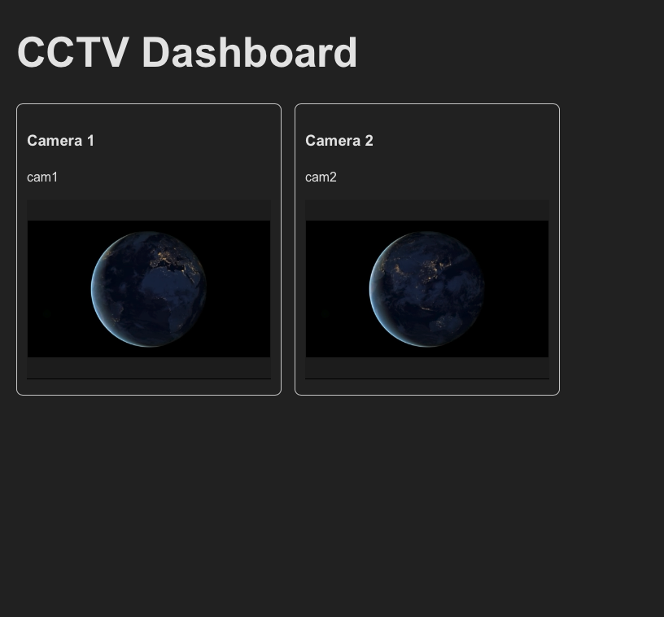

# CCTV Dashboard

Web-based CCTV dashboard built with:
- React
- Node.js / Express
- MediaMTX
- WebRTC

Using ffmpeg and a sample.mp4 file for prototype tests.

## Setup:
- ```docker compose up```
- ```text ffmpeg \
  -f avfoundation -framerate 30 -video_size 1280x720 -i "0:none" \
  -filter_complex "[0:v]split=4[v1][v2][v3][v4]" \
  -map "[v1]" -c:v h264_videotoolbox -realtime true -f rtsp -rtsp_tradwnsport tcp rtsp://localhost:8554/cam1 \
  -map "[v2]" -c:v h264_videotoolbox -realtime true -f rtsp -rtsp_transport tcp rtsp://localhost:8554/cam2 \
  -map "[v3]" -c:v h264_videotoolbox -realtime true -f rtsp -rtsp_transport tcp rtsp://localhost:8554/cam3 \
  -map "[v4]" -c:v h264_videotoolbox -realtime true -f rtsp -rtsp_transport tcp rtsp://localhost:8554/cam4 
  ```
- curl -X POST http://localhost:3001/mosaic/start
- VLC: rtsp://localhost:8554/mosaic

(what's below is obsolete, leaving for future debugging)
- ```ffmpeg -re -stream_loop -1 -i sample.mp4 -c copy -f rtsp rtsp://127.0.0.1:8554/cam1 ```
- ```npm install; npm start {backend i frontend}```
```text
ffmpeg -f avfoundation -framerate 30 -video_size 1280x720 -i "0" \
-vcodec libx264 -preset veryfast -tune zerolatency \
-f rtsp rtsp://localhost:8554/cam1
```

## Local *.mp4* test
- ```ffplay rtsp://127.0.0.1:8554/cam1```

## Dashboard

